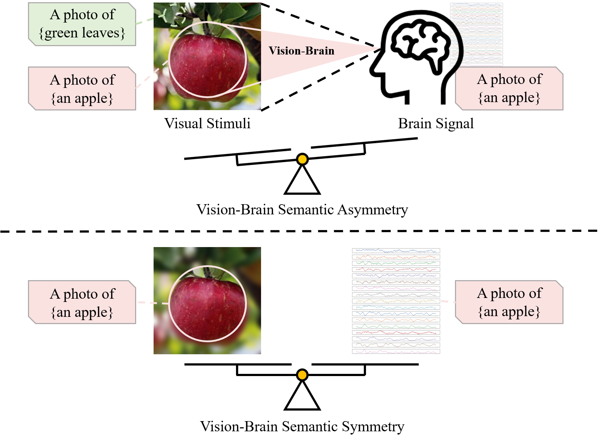
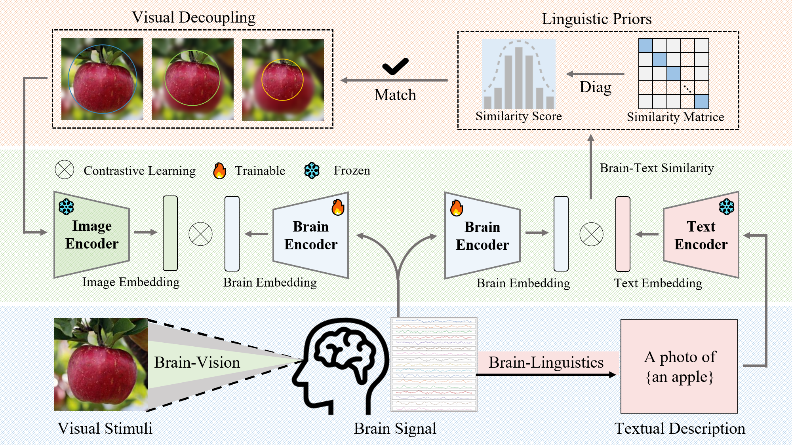

# Linguistic Priors for Visual Decoupling: Towards Symmetric Vision-Brain Alignment

This is the official implementation of **Linguistic Priors for Visual Decoupling: Towards Symmetric Vision-Brain Alignment** (CVPR 2026).

[[Paper]](https://openaccess.thecvf.com/content/CVPR2026/html/Liu_Linguistic_Priors_for_Visual_Decoupling_Towards_Symmetric_Vision-Brain_Alignment_CVPR_2026_paper.html)



## Table of Contents

- [Introduction](#introduction)
- [Repo Architecture](#repo-architecture)
- [Environment Setup](#environment-setup)
- [Data Preparation](#data-preparation)
- [Run](#run)
- [Acknowledgement](#acknowledgement)
- [Citation](#citation)
- [Contact us](#contact-us)

## Introduction

Brain visual decoding aims to recognize perceptual visual content from brain activity. Existing alignment methods often face an inherent information asymmetry between visual stimuli and brain signals: natural images contain complex object and background information, while brain responses are more strongly associated with task-relevant attended concepts and are affected by neural noise.

We propose a linguistic-prior-guided visual decoupling method for symmetric vision-brain alignment. Object-oriented textual descriptions are introduced as semantic guidance to decouple task-relevant foreground concepts from complex visual backgrounds, improving zero-shot brain-to-image retrieval on THINGS-EEG and THINGS-MEG.



## Repo Architecture

```text
BVSA/
|-- README.md
|-- requirements.txt
|-- main.py              # Main training and evaluation script
|-- data.py              # THINGS-EEG / THINGS-MEG data loading
|-- model.py             # Brain encoder backbones
|-- utils.py             # Losses, similarity modulation, blur prior, utilities
|-- fig/
|   |-- intro.png
|   `-- method.png
`-- results/             # Experiment results generated during evaluation
```

## Environment Setup

- Python 3.8.19
- CUDA 12.2
- PyTorch 2.4.1

Install the required packages with:

```bash
pip install -r requirements.txt
```

## Data Preparation

Download the required resources:

- Things-image from the [OSF repository](https://osf.io/jum2f/files/osfstorage)
- Things-EEG from the [OSF repository](https://osf.io/anp5v/files/osfstorage)
- Things-MEG from the [OpenNeuro repository](https://openneuro.org/datasets/ds004212/versions/2.0.1)
- Processed THINGS-EEG-MEG data from [Hugging Face](https://huggingface.co/datasets/TKQXX/THINGS-EEG-MEG_CVPR2026)

The default paths in `main.py` expect the processed data to be arranged as:

```text
../data/
|-- THINGS-EEG/
|   |-- Image_feature/
|   |-- Image_set_Resize/
|   `-- Preprocessed_data_250Hz_whiten/
`-- THINGS-MEG/
    |-- Image_feature/
    |-- Image_set_Resize/
    `-- preprocessed_data/
```

## Run

Run the default experiment:

```bash
python main.py
```

Common options:

```bash
python main.py --method decouple --modality eeg --exp_setting intra-subject --brain_backbone EEGProject --vision_backbone RN50 --epoch 50 --lr 1e-4
python main.py --method decouple --modality meg --exp_setting intra-subject --brain_backbone EEGProject --vision_backbone RN50 --epoch 50 --lr 1e-4
```

## Acknowledgement

We acknowledge the contributions of the following datasets:

- [A large and rich EEG dataset for modeling human visual object recognition](https://www.sciencedirect.com/science/article/pii/S1053811922008758) [THINGS-EEG]
- [THINGS-data, a multimodal collection of large-scale datasets for investigating object representations in human brain and behavior](https://pubmed.ncbi.nlm.nih.gov/36847339/) [THINGS-MEG]

The code is inspired by prior awesome works on neural and visual decoding tasks:

- [Decoding Natural Images from EEG for Object Recognition](https://github.com/eeyhsong/NICE-EEG) [ICLR 2024]
- [Bridging the vision-brain gap with an uncertainty-aware blur prior](http://openaccess.thecvf.com/content/CVPR2025/html/Wu_Bridging_the_Vision-Brain_Gap_with_an_Uncertainty-Aware_Blur_Prior_CVPR_2025_paper.html) [CVPR 2025]
- [Decouple before align: Visual disentanglement enhances prompt tuning](https://ieeexplore.ieee.org/abstract/document/11106768/) [TPAMI 2025]

## Citation

If you find this work helpful, please cite:

```bibtex
@inproceedings{liu2026linguistic,
  title={Linguistic Priors for Visual Decoupling: Towards Symmetric Vision-Brain Alignment},
  author={Liu, Dongjun and Dai, Weichen and Qian, Jingsheng and Liu, Honggang and Yi, Hangjie and Kong, Wanzeng},
  booktitle={Proceedings of the IEEE/CVF Conference on Computer Vision and Pattern Recognition},
  pages={7869--7878},
  year={2026}
}
@article{liu2026bridging,
  title={Bridging Static Images and Dynamic Brain Signal for Visual Decoding},
  author={Liu, Dongjun and Dai, Weichen and Liu, Honggang and Yi, Hangjie and Kong, Wanzeng},
  journal={IEEE Transactions on Consumer Electronics},
  year={2026},
  publisher={IEEE}
}
```

## Contact us

For any questions, please contact liudongjun@hdu.edu.cn.
